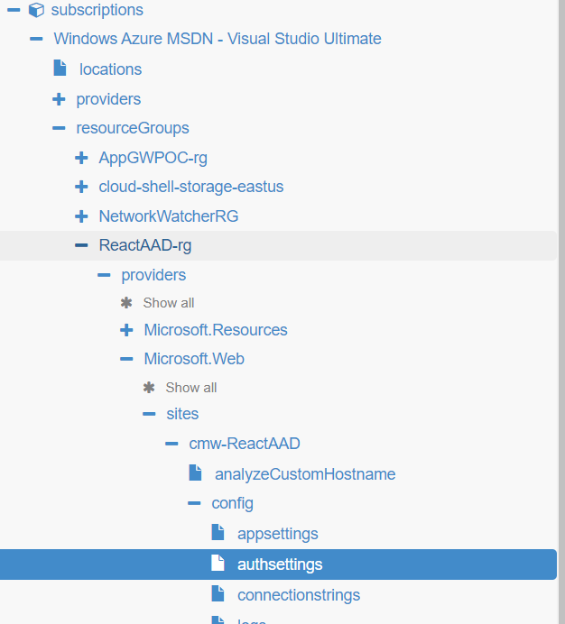
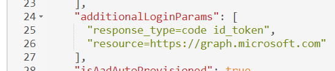

# MS Graph Toolkit in React with Azure App Service EasyAuth
This project is a demo/sample of passing an access token retrieved from EasyAuth to an MS Graph Toolkit component running in a React site that doesn't have it's own authentication.  In most scenarios the React app would have it's own auth with something like msal.js, but this demo covers the sitation where that's not in place.

High level steps to get this working.  (More detail for the special steps below.)
1. Create an Azure App Service
1. Setup EasyAuth (use the Authentication/Authorization option in the menu in the portal and pick the Express method)
1. Grant your site access to MS Graph API
1. Tweak some auth settings using Azure Resource Explorer in order to configure the access token to allow access to MS Graph API.
1. Get the access token from EasyAuth
1. Provide the token to the MS Graph Toolkit

The source code for the .net core backend and react front end are in the src folder with the interesting bits in Home.js and UserController.cs.

There are plenty of tutorials around configuring your site to use MS Graph API so I'm picking up with more detail at step 4.

#4 Once your EasyAuth is configured you need to do a little more configuration to get a useful Access Token.

1. Navigate to Azure Resource Explorer:  https://resources.azure.com/
1. Ensure the correct AAD is selected in the drop down box in the top row.
1. Use the left hand tree to navigate to your App Service > config > authsettings
    
1. Click Read/Write button
1. Click Edit button
1. Update additonal Login Params to have: "additionalLoginParams": ["response_type=code id_token", "resource=https://graph.microsoft.com"],
    
1. Review/Verify
1. Click Put button
1. Click Read Only button

Note that once you've made this change you need a fresh login session to get the correct token, so you can't just refresh the page.  (Using an In Private window is a good way to test.)

#5 EasyAuth provides the id token, access token, expiration date, and refreshtoken to your code in two ways.  In the .NET Core back end site these are in Request Headers.  Client JavaScript code can call /.auth/me to retrieve the same information.  In my example I used the request headers and a web api to retrieve just the access token, but you can call /.auth/me directly.  See https://docs.microsoft.com/en-us/azure/app-service/app-service-authentication-how-to#retrieve-tokens-in-app-code for more information.

You can see the related code in UserController.GetAccessToken and in Home.js getAccessToken.

#6 After we have the token we then need to give it to the MS Graph Toolkit.  I've done this using a [SimpleProvider](https://docs.microsoft.com/en-us/graph/toolkit/providers/custom#simpleprovider).  You can see this code in Home.js hookupMgtProvider.